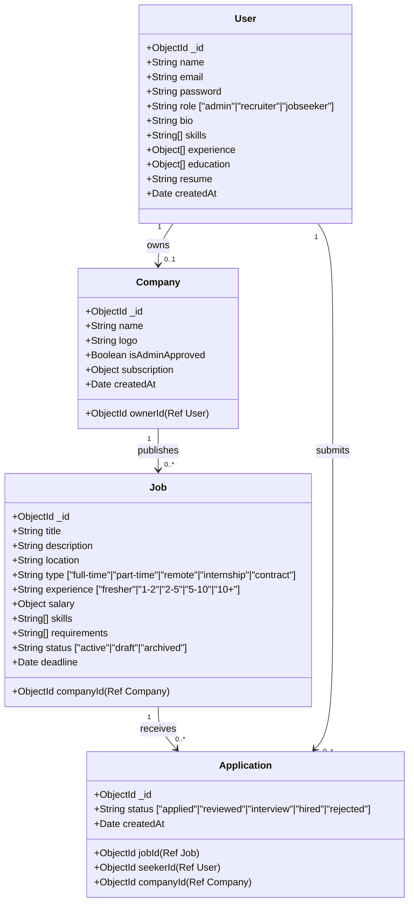
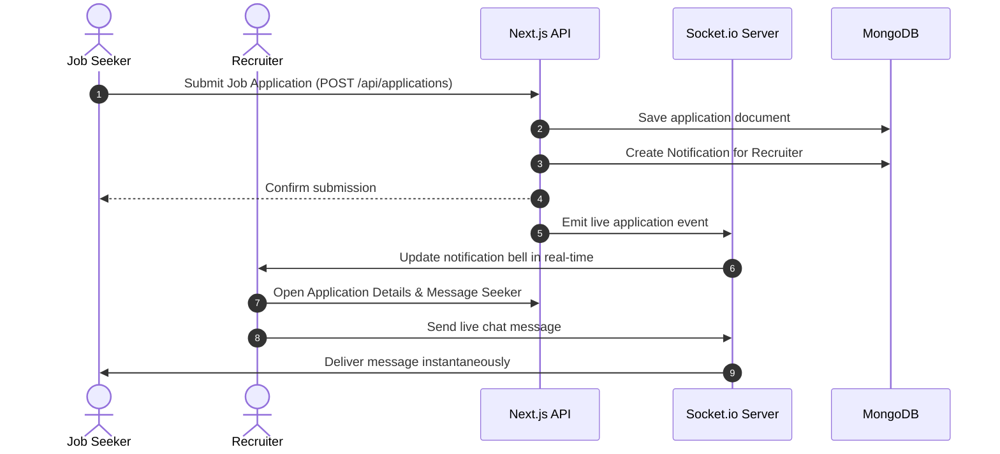
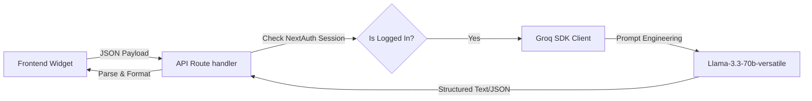
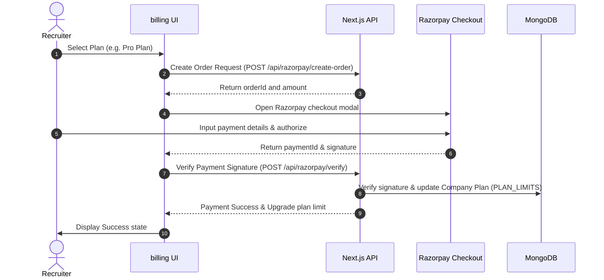

# WorkHire SaaS Platform: Architecture & Presentation Slides

This presentation document details the architecture, design, and systems of the **WorkHire** job-matching SaaS platform. You can copy the sections below directly into your presentation software (e.g., PowerPoint, slides.com, or Marp).

---

## Slide 1: Title Slide
### **WorkHire: Next-Gen AI-Powered Job Board SaaS**
*Scale Recruitment and Job Search with Real-Time Communication and Groq AI.*

*   **Presenter:** Sayan & Development Team
*   **Version:** 1.0.0
*   **Core Promise:** Seamless role-based onboarding, instant recruiter-to-candidate messaging, secure billing, and Groq-powered AI career tools.

---

## Slide 2: Technology Stack Overview
### **Modern Full-Stack Architecture**
A robust, highly optimized stack designed for fast compilation, developer productivity, and visual excellence.

| Layer | Technology | Purpose |
| :--- | :--- | :--- |
| **Core Framework** | Next.js 16.2.6 (App Router + Turbopack) | Server-side rendering (SSR), API routes, and fast builds. |
| **Styling & UI** | Tailwind CSS v4 & Lucide Icons | Harmonic colors, sleek micro-animations, and responsive designs. |
| **Database** | MongoDB & Mongoose | Flexible NoSQL document models for jobs, users, and applications. |
| **Authentication** | NextAuth.js | Role-Based Access Control (RBAC) with secure session handling. |
| **Real-time Messaging**| Socket.io & socket.io-client | Live messaging channels between recruiters and candidates. |
| **Cloud Storage** | Cloudinary & Multer | Secure uploads for resumes, profile pictures, and company logos. |
| **AI Integration** | Groq SDK (Llama-3.3-70b-versatile) | Fast AI cover letters, resume matches, and job descriptions. |
| **Payment Gateway** | Razorpay SDK | Plan limits, secure checkout, and recruiter subscription models. |

---

## Slide 3: Database & Entity Relationship
### **Mongoose Data Models**
The data model connects Job Seekers, Recruiters, and Admin roles.



---

## Slide 4: Authentication & Routing Boundaries
### **Role-Based Routing Security**
Routes are protected by a Next.js `Proxy (Middleware)` boundary ensuring users can only access their specific portals.

```mermaid
flowchart TD
    Req[incoming Request] --> Proxy{Proxy Middleware}
    Proxy -- Authenticated Seeker --> Seeker[/dashboard/*]
    Proxy -- Authenticated Recruiter --> Recruiter[/company/dashboard/*]
    Proxy -- Authenticated Admin --> Admin[/admin/*]
    Proxy -- Unauthenticated --> Login[Redirect to /login]
```

*   **Seeker Portal (`/dashboard`)**: Profile setup, tracking applications, chat, AI cover letter writer, and ATS resume analyzer.
*   **Recruiter Portal (`/company/dashboard`)**: Manage company profile, post/edit jobs (AI descriptions), review candidates, and handle payment billing.
*   **Admin Console (`/admin`)**: Verify companies, suspend accounts, and view platform metrics and revenue.

---

## Slide 5: System Interactions & Event Flows
### **Real-Time Application Lifecycle**
How seekers, recruiters, notifications, and real-time chat connect.



---

## Slide 6: Groq AI Integration Architecture
### **ATS Matching and Intelligent Drafting**
AI endpoints are connected directly to Meta's Llama-3.3-70b-versatile model through Groq LPUs for sub-2 second response times.



*   **Recruiter Tool (`/api/ai/job-description`)**: Automatically formats "About the Role", "Key Responsibilities", "Requirements", and "What We Offer".
*   **Seeker Tool (`/api/ai/cover-letter`)**: Auto-pulls profile skills and history to draft personalized documents.
*   **Seeker Tool (`/api/ai/resume-analyzer`)**: Performs semantic comparison, outputting an **ATS score**, **Strengths**, **Improvements**, and **Missing Skills**.

---

## Slide 7: Payments & monetization Strategy
### **Razorpay Subscription Gateway**
Controls limits for job postings based on monthly tier models (Free, Pro, Enterprise).



*   **PLAN_LIMITS Schema**:
    *   **Free**: 1 active job post limit.
    *   **Pro**: 10 active job posts, access to AI templates.
    *   **Enterprise**: Unlimited job posts, custom company branding.

---

## Slide 8: Real-Time Chat System
### **Live Candidate Messaging**
Socket.io keeps communication fluid, removing email lag between candidates and recruiters.

*   **Socket Handlers**:
    *   `join_room`: Establishes session boundaries for individual applicant chats.
    *   `send_message`: Routes messages to the active room.
    *   `receive_message`: Delivers incoming payloads directly to the opponent's message window.
*   **Database persistence**: Each socket message is simultaneously logged in the MongoDB `messages` collection to ensure conversation history is loaded on page refresh.

---

## Slide 9: Platform Benefits & Highlights
### **Why WorkHire Stands Out**

1.  **Fast & Responsive UI**: Glassmorphic designs, responsive flex tables, custom circular SVG gauges, and animations provide a premium look and feel.
2.  **LPU AI Speed**: Utilizing Groq rather than OpenAI API keys means job description and resume analysis times are reduced from 10+ seconds to under 2 seconds.
3.  **End-to-End Recruitment**: From posting a job using AI to real-time chat and payment verification, all operations reside under a single, unified, secure ecosystem.
